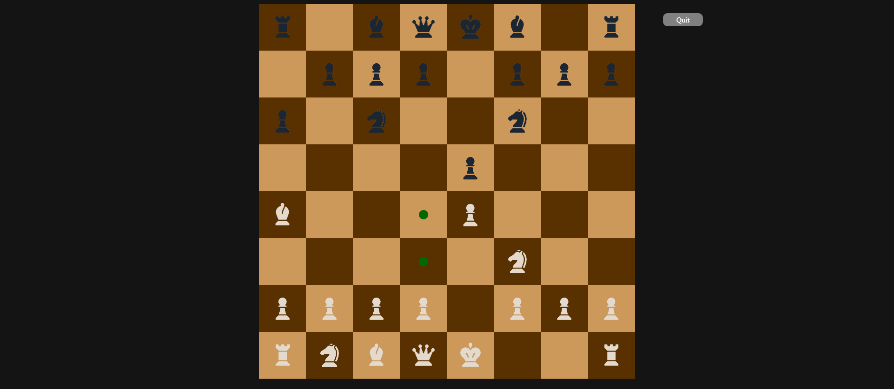

# chess
A **p5.js**-powered local/online multiplayer chess app made without the help of any chess libraries.

This was my end-of-highschool project.

It has a good few issues, but I think it's alright for a high-school graduate.

The app ~is~ _used to be_ hosted on Heroku. ~It can be played [here](http://insanechess.herokuapp.com).~

